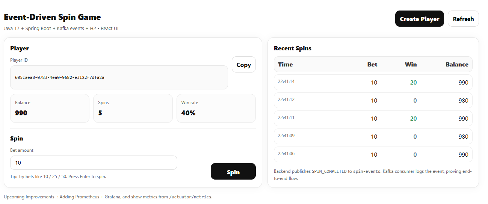
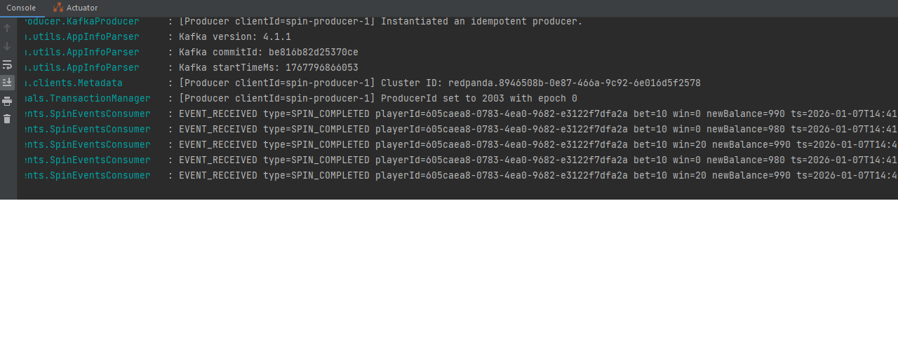

# Spin Game (Java + Spring Boot + Kafka + React)

A small, production-minded demo that simulates a core mechanic of a free-to-play social game: **player spins**, **virtual currency**, and **domain events** published asynchronously.

This project was built to demonstrate cloud-native, event-driven backend thinking similar to systems that power high-scale player experiences.

---

## Screenshots





## Tech Stack

### Backend
- Java 17
- Spring Boot (REST APIs)
- Kafka-compatible broker (Redpanda via Docker)
- H2 (in-memory database for demo purposes)
- Spring Kafka (JSON event serialization)
- Spring Boot Actuator (health & metrics)

### Frontend
- React (Vite)

---

## What This Project Demonstrates

- **Event-driven architecture**: Game actions publish domain events (`SPIN_COMPLETED`) to Kafka.
- **Asynchronous messaging**: Kafka consumer processes and logs events to prove end-to-end flow.
- **Operational mindset**: Health checks and metrics via Actuator.
- **Cloud-native design**: Runs locally but maps directly to AWS-managed services.

---

## High-Level Architecture (MVP)

1. User creates a player (initial demo balance)
2. User performs a spin with a bet amount
3. Backend validates input and updates wallet balance
4. Backend publishes a `SPIN_COMPLETED` domain event to Kafka topic `spin-events`
5. Kafka consumer receives and logs the event

### Example Domain Event

```json
{
  "eventType": "SPIN_COMPLETED",
  "playerId": "uuid",
  "bet": 10,
  "win": 20,
  "newBalance": 990,
  "timestamp": "2026-01-06T15:32:28.370232Z"
}
```

---

## Running the Project Locally

### Prerequisites
- Docker
- Java 17
- Node.js 18+

### 1) Start Kafka-Compatible Broker (Redpanda)

```bash
cd infra
docker compose up -d
```

### 2) Run Backend

```bash
cd backend
./mvnw spring-boot:run
```

Backend runs at:
- http://localhost:8080

Useful endpoints:
- POST `/api/player`
- POST `/api/spin`
- GET  `/api/balance/{playerId}`
- GET  `/actuator/health`
- GET  `/actuator/metrics`

### 3) Run Frontend

```bash
cd frontend
npm install
npm run dev
```

Frontend runs at:
- http://localhost:5173

---

## Cloud / AWS Mapping

This local MVP maps naturally to a production AWS setup:

| Local Component | AWS Equivalent |
|----------------|----------------|
| Docker / Local runtime | EKS |
| Kafka / Redpanda | MSK |
| H2 (demo DB) | DynamoDB |
| Actuator / Metrics | CloudWatch / Prometheus / Grafana |
| REST APIs | ALB + API Gateway |

---

## Possible Next Improvements

- Split into microservices (player-service, wallet-service, game-service)
- Replace H2 with DynamoDB Local (then AWS DynamoDB)
- Add idempotency keys and retry/DLQ patterns
- Add Prometheus + Grafana dashboards
- Introduce authentication (JWT) and rate limiting

---

## Notes

This project is intentionally scoped as an MVP to highlight backend architecture, messaging patterns, and operational practices rather than game UI complexity.
